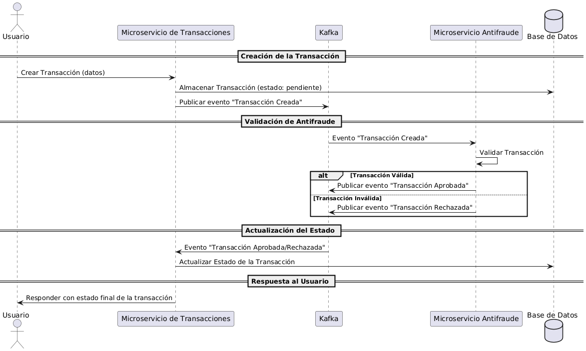
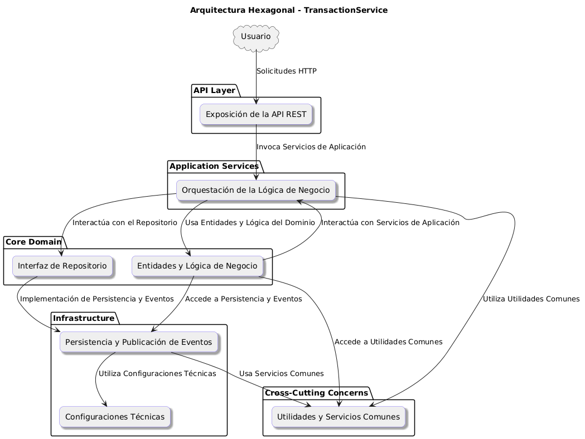
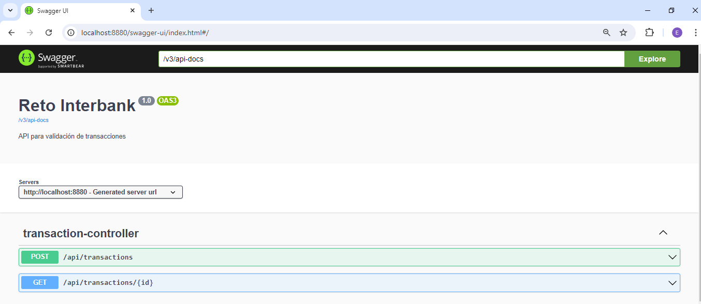
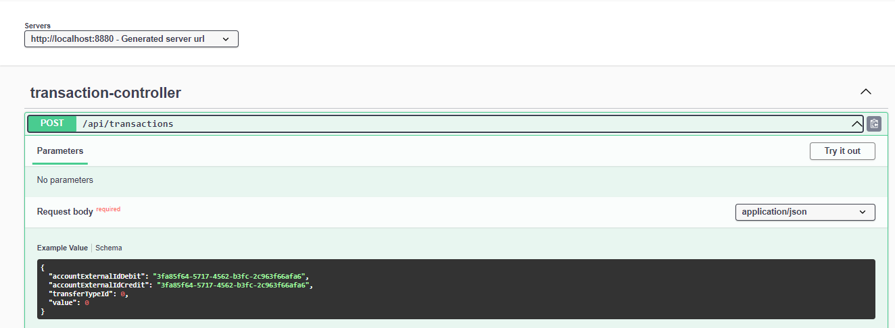
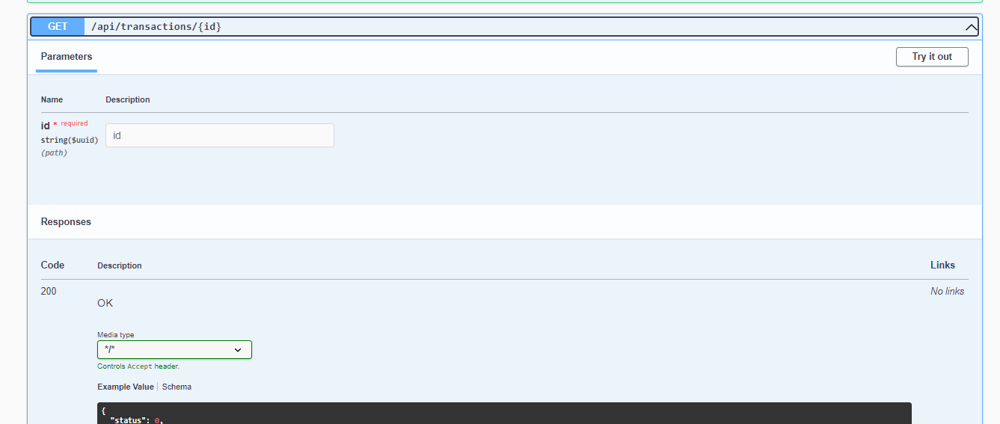
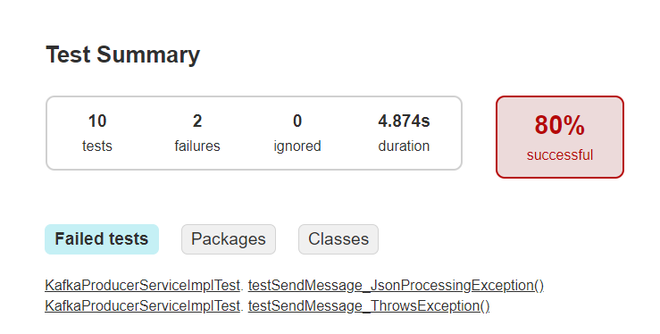
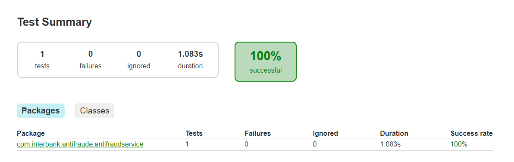

# Reto de Programación en Java para Interbank 🚀

Este documento describe la solución implementada para el reto de programación solicitado por Interbank - Comercial y MDC.

## Resumen del Reto

El objetivo del reto fue desarrollar un sistema para gestionar transacciones financieras. Cada vez que se crea una transacción, esta debe ser validada por un microservicio antifraude. Dependiendo del resultado de la validación, la transacción se actualiza a un estado de "Aprobado" o "Rechazado". Las transacciones pueden tener los siguientes estados:

- **Pendiente:** Estado inicial cuando se crea la transacción.
- **Aprobado:** Estado final cuando la transacción pasa la validación antifraude.
- **Rechazado:** Estado final cuando la transacción no pasa la validación antifraude.

**Regla de negocio clave:** Toda transacción con un valor mayor a 1000 debe ser rechazada automáticamente.

## Diagrama de Secuencia

El siguiente diagrama de secuencia ilustra el flujo completo desde la creación de una transacción hasta la respuesta final al usuario:



## Microservicios

El sistema se compone de dos microservicios principales:

1. **TransactionService**: Se encarga de la creación, almacenamiento y consulta de transacciones. Publica eventos en Kafka para iniciar la validación y actualiza el estado según la validación de fraudes.

2. **AntiFraudService**: Recibe los eventos de transacción desde Kafka, valida las transacciones y publica el resultado (aprobado o rechazado) nuevamente en Kafka para que el estado de la transacción sea actualizado.

## Arquitectura


### Descripción de las Capas - Arquitectura Hexagonal en los microservicios creados

Este documento describe las diferentes capas de la arquitectura hexagonal implementada en los microservicios. Cada capa tiene responsabilidades específicas que contribuyen al correcto funcionamiento y mantenimiento del sistema.

#### API Layer

**Responsabilidad:**  
Esta capa maneja la exposición de la API REST. Es el punto de entrada para las solicitudes de los usuarios y otros sistemas externos. La API Layer procesa las solicitudes HTTP, valida los datos de entrada, y delega la lógica de negocio a la capa de Servicios de Aplicación.


#### Application Services

**Responsabilidad:**  
La capa de Servicios de Aplicación orquesta las operaciones de negocio. Aquí se define la lógica que combina la funcionalidad del dominio y la infraestructura para cumplir con las solicitudes de la API. También asegura que las operaciones se realicen en el orden correcto y siguiendo las reglas de negocio establecidas.

#### Core Domain

**Responsabilidad:**  
La capa del Dominio es el corazón de la aplicación. Contiene las entidades principales y la lógica de negocio pura. También define las interfaces de repositorio que abstraen el acceso a los datos, permitiendo que la lógica de negocio sea independiente de la infraestructura técnica.

#### Infrastructure

**Responsabilidad:**  
La capa de Infraestructura implementa los detalles técnicos de persistencia de datos, publicación de eventos, y otras configuraciones específicas del entorno. Esta capa cumple con las interfaces definidas en el dominio y proporciona las funcionalidades técnicas necesarias para que la aplicación funcione correctamente.

#### Cross-Cutting Concerns

**Responsabilidad:**  
Esta capa transversal proporciona utilidades y servicios comunes que son utilizados por todas las demás capas. Incluye funcionalidades como validaciones, manejo de excepciones, logging, y otras utilidades que son independientes del dominio pero necesarias para la operación del sistema.

#### Interacciones entre Capas

- **API Layer** interactúa directamente con **Application Services** para procesar las solicitudes de los usuarios.
- **Application Services** utiliza **Core Domain** para aplicar la lógica de negocio y también para acceder a  **Infrastructure** para persistir datos y publicar eventos.
- **Core Domain** define las reglas de negocio y las interfaces necesarias para la persistencia y publicación de eventos, y puede interactuar tanto con **Application Services** como con **Infrastructure**.
- **Cross-Cutting Concerns** está disponible para todas las capas, proporcionando utilidades y servicios comunes que mejoran la funcionalidad y mantenibilidad del sistema.

---

### Flujos Clave

1. **Creación de Transacción**: El usuario crea una transacción a través de `TransactionService`, que almacena la transacción en estado pendiente y publica un evento en Kafka.

2. **Validación de Antifraude**: El `AntiFraudService` consume el evento de Kafka, valida la transacción y publica un nuevo evento indicando si la transacción fue aprobada o rechazada.

3. **Actualización de Estado**: El `TransactionService` consume el resultado de la validación antifraude desde Kafka y actualiza el estado de la transacción en la base de datos.

## Stack Tecnológico

- **Java 17** - Lenguaje de programación utilizado.
- **Spring Boot 3.3.2** - Framework utilizado para desarrollar los microservicios.
- **PostgreSQL** - Base de datos relacional utilizada para almacenar las transacciones.
- **Apache Kafka** - Plataforma de mensajería utilizada para la comunicación entre microservicios.
- **Docker** - Utilizado para la configuración del entorno de desarrollo y despliegue de los microservicios.

#### Uso

##### Comandos Docker

Para manejar el entorno Docker, utiliza los siguientes comandos:

1. **Construir las imágenes Docker:**

   ```bash
   docker-compose up --build -d

2. **Apagar los servicios::**
   ```bash
   docker-compose down

#### Iniciar la aplicación
El servicio tiene implementado sagger la cual facilita las pruebas del API.
El servicio TransactionService, se ejcuta en el puerto 8880, el mismo que podremo ingresar al sagger con la sigueinte ruta luego de haber iniciado la aplicación: http://localhost:8880/swagger-ui/index.html






#### Pruebas Unitarias


---
Autor: Arturo Eduardo Fajardo Gutiérrez
Correo: efajardogutierrez@hotmail.com
